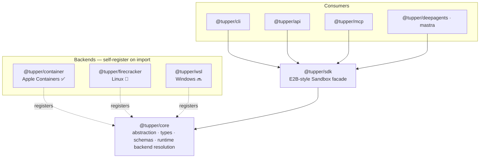

# Tupper

> Open-source **sandboxes for AI agents** — run untrusted, AI-generated code safely on your own machine. Backed by Apple Containers, with an E2B-style TypeScript SDK.

[](https://www.npmjs.com/package/@tupper/sdk)
[](https://github.com/lightbearco/tupper/actions/workflows/ci.yml)
[](LICENSE)
[](tsconfig.base.json)
[](https://bun.com)

**Tupper** gives AI agents an isolated environment to execute code, run shell commands, and read and write files — without putting the host at risk. It's a self-hostable, **platform-agnostic** alternative to hosted code-execution sandboxes like [E2B](https://e2b.dev), [Daytona](https://www.daytona.io), and [Modal](https://modal.com): the same E2B-style SDK, but running on your own machine through [Apple Containers](https://github.com/apple/container) on macOS today (with Firecracker for Linux and WSL for Windows on the way).

> [!NOTE]
> Tupper is in early development. `@tupper/core`, `@tupper/container`, and `@tupper/sdk` are functional; APIs may change before 1.0.

## Contents

- [Features](#features)
- [Requirements](#requirements)
- [Installation](#installation)
- [Quick start](#quick-start)
- [Packages](#packages)
- [Architecture](#architecture)
- [How sandboxing compares](#how-sandboxing-approaches-compare)
- [FAQ](#faq)
- [Documentation](#documentation)
- [Roadmap](#roadmap)
- [Contributing](#contributing)
- [License](#license)

## Features

- **One SDK, every OS** — write your agent code once; Tupper selects the right sandbox runtime for the host automatically (Apple Containers on macOS, Firecracker on Linux, WSL on Windows). New platforms are drop-in — backends self-register on import.
- **E2B-style SDK** — `Sandbox.create()`, `commands.run()`, `files.*`, plus reconnect and lifecycle control.
- **Native macOS sandboxing** — Apple Containers via the `container` CLI, with no Docker daemon required.
- **Runs on Node or Bun** — a lean core (Zod its only runtime dependency); source uses Node built-ins only and ships no `Bun.*` APIs, so it runs unchanged on either runtime.
- **Agent-framework ready** — drop-in sandbox backends for deepagents and Mastra, plus a [Model Context Protocol](https://modelcontextprotocol.io) server, a CLI, and an HTTP API.

## Requirements

- **macOS 26+** with Apple's [`container`](https://github.com/apple/container) CLI for the default backend (start it once with `container system start`).
- **Node 18+** or **[Bun](https://bun.com) 1.1+** to consume the packages.

## Installation

```bash
# Bun
bun add @tupper/sdk @tupper/container

# npm
npm install @tupper/sdk @tupper/container
```

Install the sandbox backend for your platform alongside the SDK — it is an optional peer dependency (`@tupper/container` on macOS).

## Quick start

```ts
import { Sandbox } from "@tupper/sdk";

const box = await Sandbox.create({ image: "docker.io/library/alpine:latest" });
try {
  await box.files.write("/tmp/hi.txt", "hello");
  const res = await box.commands.run("cat /tmp/hi.txt");
  console.log(res.stdout); // "hello"
} finally {
  await box.kill();
}
```

More in [Getting started](docs/getting-started.md) and the [SDK reference](docs/sdk.md).

## Packages

### Core

| Package | Version | Description |
| --- | --- | --- |
| [`@tupper/core`](packages/core) | [](https://www.npmjs.com/package/@tupper/core) | Backend-agnostic sandbox abstraction, shared types, Zod schemas, and dynamic backend resolution. |

### Backends

Self-register on import; `@tupper/core` selects one for the host platform.

| Package | Version | Description |
| --- | --- | --- |
| [`@tupper/container`](packages/container) | [](https://www.npmjs.com/package/@tupper/container) | Apple Containers (`container` CLI, macOS 26+). |
| [`@tupper/firecracker`](packages/firecracker) | [](https://www.npmjs.com/package/@tupper/firecracker) | Firecracker microVMs for Linux (nerdctl / firecracker-containerd). 🧪 Experimental. |
| [`@tupper/wsl`](packages/wsl) | — | WSL for Windows. 🔜 Planned. |

### Frontends

Ways to drive sandboxes, all built on `@tupper/sdk`.

| Package | Version | Description |
| --- | --- | --- |
| [`@tupper/sdk`](packages/sdk) | [](https://www.npmjs.com/package/@tupper/sdk) | E2B-style `Sandbox` facade over core — the main programmatic API. |
| [`@tupper/cli`](packages/cli) | [](https://www.npmjs.com/package/@tupper/cli) | `tupper` command-line interface. |
| [`@tupper/api`](packages/api) | [](https://www.npmjs.com/package/@tupper/api) | HTTP API over the SDK (Hono). |
| [`@tupper/mcp`](packages/mcp) | [](https://www.npmjs.com/package/@tupper/mcp) | Model Context Protocol server. |

### Integrations

Drop-in sandbox backends for agent frameworks.

| Package | Version | Description |
| --- | --- | --- |
| [`@tupper/deepagents`](packages/deepagents) | [](https://www.npmjs.com/package/@tupper/deepagents) | LangChain deepagents sandbox backend. |
| [`@tupper/mastra`](packages/mastra) | [](https://www.npmjs.com/package/@tupper/mastra) | Mastra `WorkspaceSandbox` backend. |

## Architecture



`@tupper/core` never statically imports a backend — it selects one at runtime from the host platform (`darwin → @tupper/container`, `linux → @tupper/firecracker`, `win32 → @tupper/wsl`) and backends self-register on import, so adding a platform is drop-in. You can override the choice with `Sandbox.create({ backend: "@tupper/firecracker" })`. See [Architecture](docs/architecture.md) for details.

## How sandboxing approaches compare

Sandboxes trade **boot speed** for **isolation strength**, and they differ in whether they hand you a full OS image or just confine a host process. Tupper isn't a hosted service like E2B, Daytona, or Modal — it runs locally — so the fair comparison is by *isolation approach*, with each tool placed in its tier:

| Approach | OCI image | Kernel | Boundary | Boot (class) | Examples |
| --- | --- | --- | --- | --- | --- |
| Process sandbox | ❌ | shared | host kernel | ~instant (µs–ms) | macOS Seatbelt · Linux seccomp / Landlock · Windows AppContainer |
| Container, shared kernel | ✅ | shared | host kernel | ~tens of ms | Docker · Daytona |
| **microVM / VM-per-container** | ✅ | own | hardware VM | ~100–300 ms | Firecracker (E2B) · **Apple Containers (Tupper)** · WSL2 · gVisor (Modal) † |

Tupper sits in the top tier — every sandbox gets its **own kernel** and runs a **full OCI image** — but **on your own machine**, using the OS's native virtualization (Apple's Virtualization.framework today; Firecracker/KVM and WSL2/Hyper-V planned). Native *process* sandboxes like Seatbelt and AppContainer start instantly but can't run an image or give an agent a clean Linux box to `pip install` into; Tupper trades a few hundred milliseconds of boot for that full, disposable environment.

<sub>† gVisor is a user-space kernel, sitting between containers and full VMs. Boot figures are the underlying runtimes' published numbers (not a Tupper benchmark) and vary by image, configuration, and host. Sources: [Apple Containers](https://thenewstack.io/apple-containers-on-macos-a-technical-comparison-with-docker/) · [Firecracker](https://firecracker-microvm.github.io/) · [E2B & Daytona](https://www.zenml.io/blog/e2b-vs-daytona) · [Modal](https://modal.com/docs/guide/cold-start) · [Windows Sandbox](https://learn.microsoft.com/en-us/windows/security/application-security/application-isolation/windows-sandbox/)</sub>

## FAQ

### What is an AI agent sandbox?

An isolated environment where an LLM agent can execute code and shell commands without access to your host machine — limiting the blast radius of untrusted or AI-generated code so a misbehaving agent can't read your files, reach your network, or break your system.

### How is Tupper different from hosted sandboxes like E2B, Daytona, or Modal?

Those services run your agent's code in their cloud and bill per use. Tupper offers the same kind of SDK but runs sandboxes locally on your own machine — no cloud account, no per-sandbox network latency, and your code never leaves your infrastructure. It's earlier-stage and single-host by design.

### Does Tupper need Docker?

No. On macOS, Tupper uses Apple's native [`container`](https://github.com/apple/container) runtime — no Docker daemon. It runs any Linux OCI image, so your agent can use Python, Node.js, Go, and more.

### Can I use Tupper with deepagents or Mastra?

Yes — [`@tupper/deepagents`](packages/deepagents) and [`@tupper/mastra`](packages/mastra) provide ready-made sandbox backends for those frameworks. For any other client, [`@tupper/mcp`](packages/mcp) exposes sandboxes over the [Model Context Protocol](https://modelcontextprotocol.io).

## Documentation

- [Getting started](docs/getting-started.md) — prerequisites, install, your first sandbox.
- [SDK reference](docs/sdk.md) — the `@tupper/sdk` `Sandbox` API.
- [Architecture](docs/architecture.md) — layering and runtime backend resolution.

## Roadmap

- **Available** — `@tupper/core`, `@tupper/container` (macOS), `@tupper/sdk`, `@tupper/firecracker` (Linux, experimental), `@tupper/deepagents`, `@tupper/mastra`, `@tupper/cli`, `@tupper/api`, `@tupper/mcp`. ✅
- **Planned** — `@tupper/wsl` (Windows).

## Contributing

Contributions are welcome! Please read [CONTRIBUTING.md](CONTRIBUTING.md) and our [Code of Conduct](CODE_OF_CONDUCT.md). Found a vulnerability? Follow our [security policy](SECURITY.md).

```bash
git clone https://github.com/lightbearco/tupper.git
cd tupper
bun install
bun test
```

## License

[MIT](LICENSE) © Tupper contributors

---

<sub>**Keywords:** AI agent sandbox · sandboxed code execution · code interpreter · run untrusted code · E2B alternative · Apple Containers · Firecracker · WSL · LLM agent runtime · self-hosted sandbox · TypeScript</sub>
