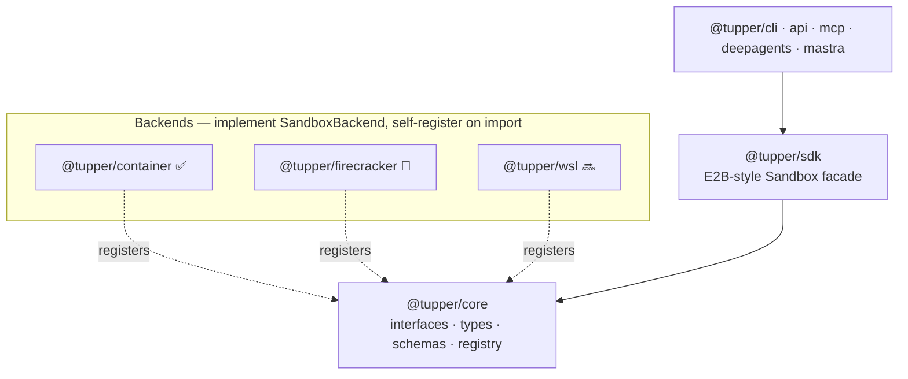
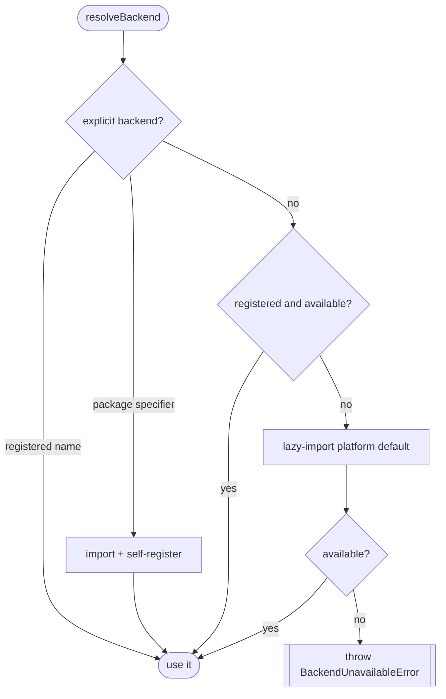

# Architecture

Tupper is layered so that one abstraction (`@tupper/core`) is shared by many backends and many consumers.

## `@tupper/core`

Core's only runtime dependency is [Zod](https://zod.dev) (for the shared validation schemas in `schemas.ts`). It defines two interfaces every backend implements:

- **`SandboxBackend`** — a runtime that provisions sandboxes: `name`, `isAvailable()`, `create(opts?)`, `connect(id)`, `list()`.
- **`SandboxInstance`** — one sandbox: `id`, `backend`, `execute(command, opts?)`, `writeFiles(files)`, `readFiles(paths)`, `info()`, `setTimeout(ms)`, `kill()`, `getHost(port)`.

`execute` is the universal primitive — it matches the deepagents `BaseSandbox` contract, and higher-level file operations in the SDK build on it. The interface is deliberately the union of what the deepagents, Mastra, and E2B-style consumers need, so adapters stay thin.

## Backend resolution

Core never statically imports a backend. `resolveBackend(options?)` selects one in this order:

The platform defaults are `darwin → @tupper/container`, `linux → @tupper/firecracker`, `win32 → @tupper/wsl`. Backends **self-register on import** by calling `registerBackend(...)`, so installing a backend package is all it takes to make it selectable.

### The injectable loader

The lazy `import()` resolves relative to the module that performs it. If core did the import, the specifier would resolve against *core's* `node_modules` — which breaks in symlinked workspaces where core doesn't depend on the backends. So `resolveBackend({ load })` accepts a loader, and `@tupper/sdk` passes its own `(s) => import(s)`. The specifier then resolves against the SDK's `node_modules`, where backends are declared as optional peer dependencies. This works in both symlinked monorepos and flat npm installs.

## Runtime portability

All package source uses Node built-ins only — `node:child_process` (`spawn` with an argv array, never a shell), `node:fs/promises`, `node:os`, `node:path`. There are no `Bun.*` runtime APIs, so the libraries run unchanged on Node and Bun. Bun is used only as dev/test tooling.

## Errors

`TupperError` is the base class. Subclasses: `BackendUnavailableError`, `SandboxNotFoundError`, `CommandTimeoutError`.
